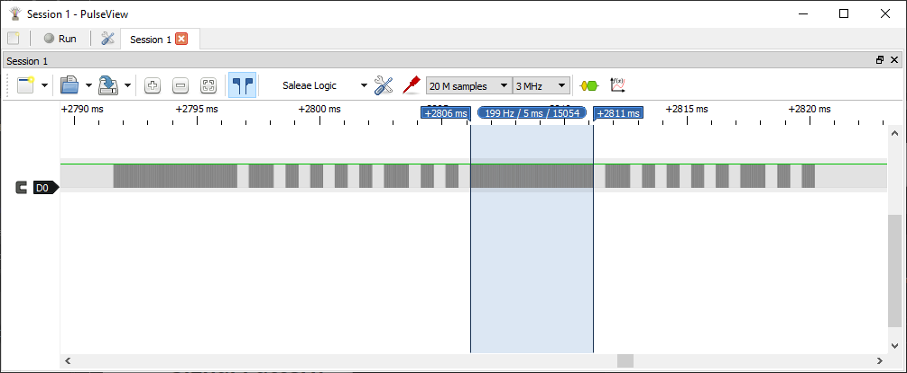
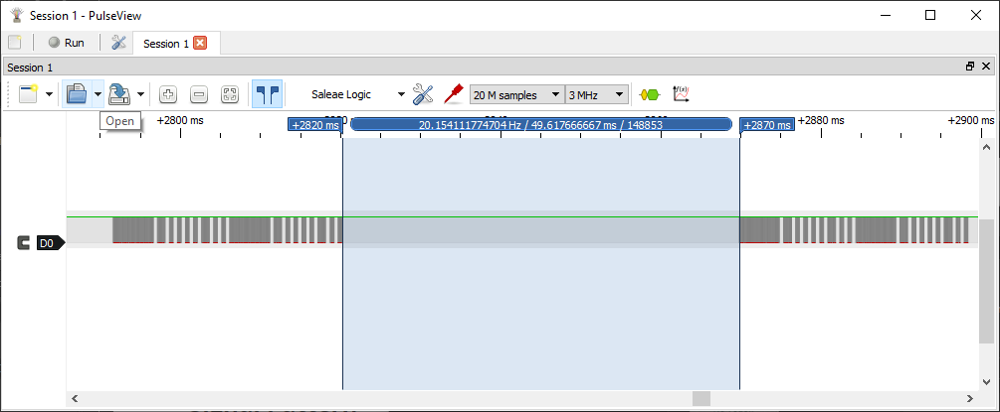
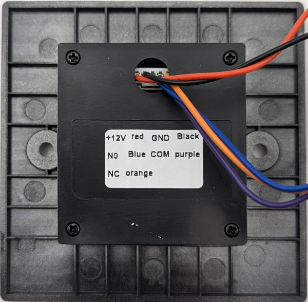

### Device Description

An all plastic exit sensor, there is no outer bezel just an illuminated ring around the large IR filter with the text "NO TOUCH" printed on it.

### Source

Provided by [en4rab](https://twitter.com/en4rab)/[en4rab](https://github.com/en4rab).

### Signal Pattern

38.7kHz modulation. A simple repeating pattern based on multiples of roughly ~500 μs, with on times in multiples of 10, 2, 1, 1, 1, 1, 2, 1, 1. This pattern is repeated twice followed by a gap of 49.62 mS.

E.g. follow pattern confirmed as working.

* 1010 μs on
* 504 μs off
* 1002 μs on
* 504 μs off
* 501 μs on
* 504 μs off
* 501 μs on
* 504 μs off
* 501 μs on
* 504 μs off
* 501 μs on
* 504 μs off
* 1002 μs on
* 504 μs off
* 501 μs on
* 504 μs off
* 501 μs on

The 10, 2, 1, 1, 1, 1, 2, 1,1 signal repeats twice

With a gap of 49.62 mS

A pulseview recording of this signal made using a TSMP58000 can be found in the [/sigrok/ebnt_tf_3](/sigrok/ebnt_tf_3) directory. 

### Images

