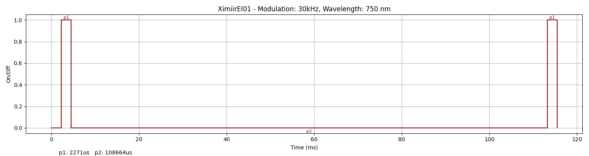
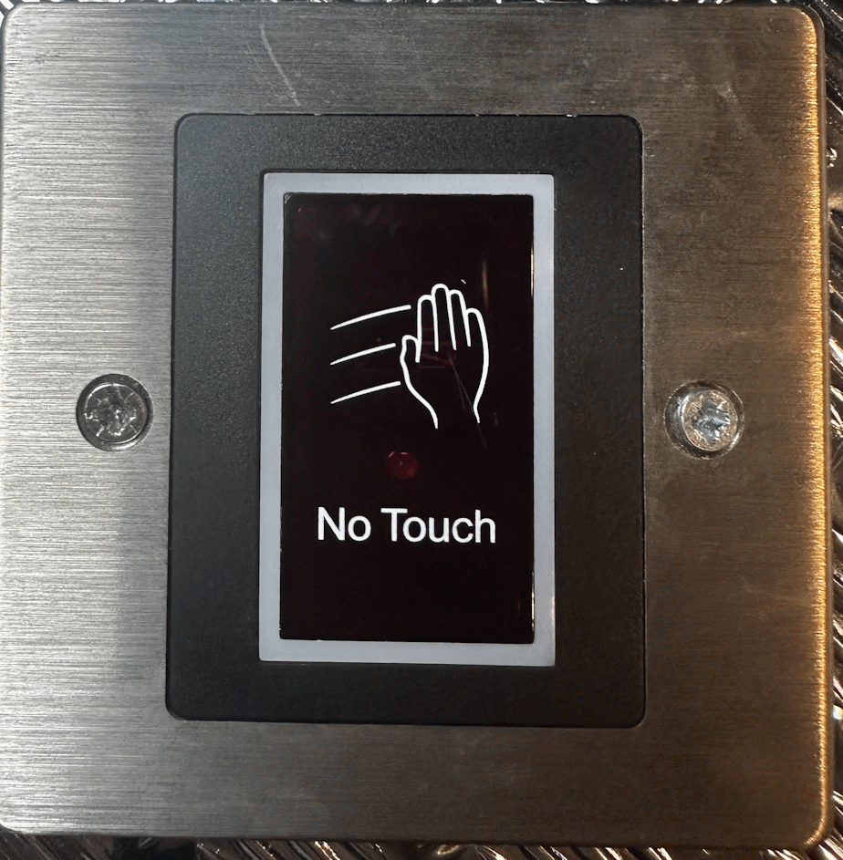

### Device Description

Yet another cheap device off AliExpress with a plastic shell. 

### Source

Provided by [@therealshodan](https://twitter.com/therealshodan)/[i-am-shodan](https://github.com/i-am-shodan). Purchased from AliExpress in 2025.

### Signal Pattern

Simple pulse, triggers on pretty much anything and only really usable with the sensitivity turn to min.

##### irplot.py data
```
30kHz, 750 nm, XimiirEI01, 1, 2271us, 108664us
```

##### irplot.py trace


### Images


