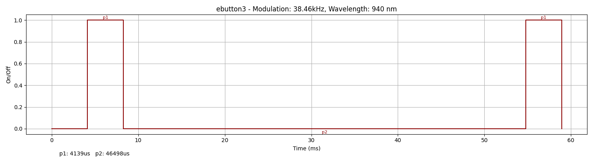
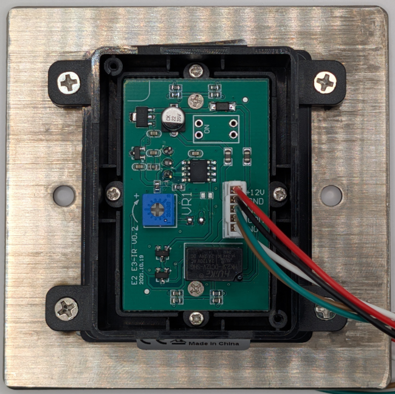

### Device Description

Yet another cheap device off AliExpress with a plastic shell. 

### Source

Provided by [@therealshodan](https://twitter.com/therealshodan)/[i-am-shodan](https://github.com/i-am-shodan). Purchased from AliExpress in 2025.

### Signal Pattern

Simple pulse, triggers on pretty much anything and only really usable with the sensitivity turn to min.
A pulseview recording made using a logic analyser connected to the LED can be found in the [/sigrok/ebutton3](/sigrok/ebutton3) directory.

##### irplot.py data
```
38kHz, 950 nm, ebutton3, 1, 4138us, 46498us
```

##### irplot.py trace


### Images


