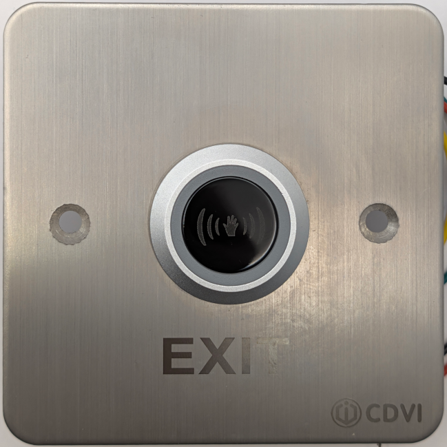
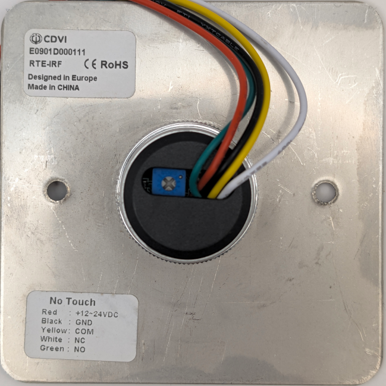

### Device Description

This RTE-IRF is a sensor sold by the company CDVI. The RTE-IRF is a stainless steel plate with a small (3cm) round sensor. The sensor has a circular metal bezel with a frosted look around the central IR filter. The filter has a distinctive (((🖐))) print.
The CDVI company logo is etched into the stainless at the bottom right corner.

### Source

Provided by [en4rab](https://twitter.com/en4rab)/[en4rab](https://github.com/en4rab). Purchased from Ebay August 2026

### Signal Pattern

The signal pattern has not yet been measured however preliminary testing found the sensor would trigger when presented with the same signals for the ds-k7p03, sp80 and smb_i016 sensors.
Recording and playing back the signal with a flipper zero was also able to trigger the sensor occasionally but not reliably. Possibly it stops listening due to interference being detected and needs bigger delays between signals but this requires more investigation.

##### irplot.py data

##### irplot.py trace

### Images

