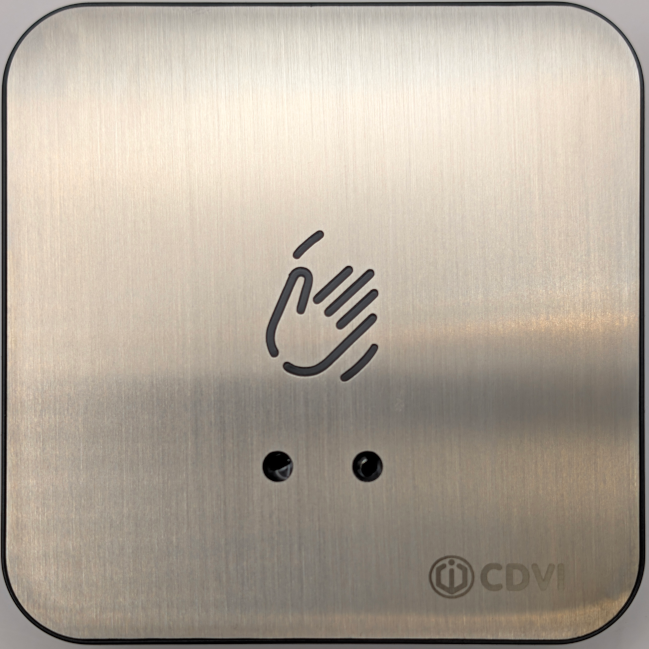
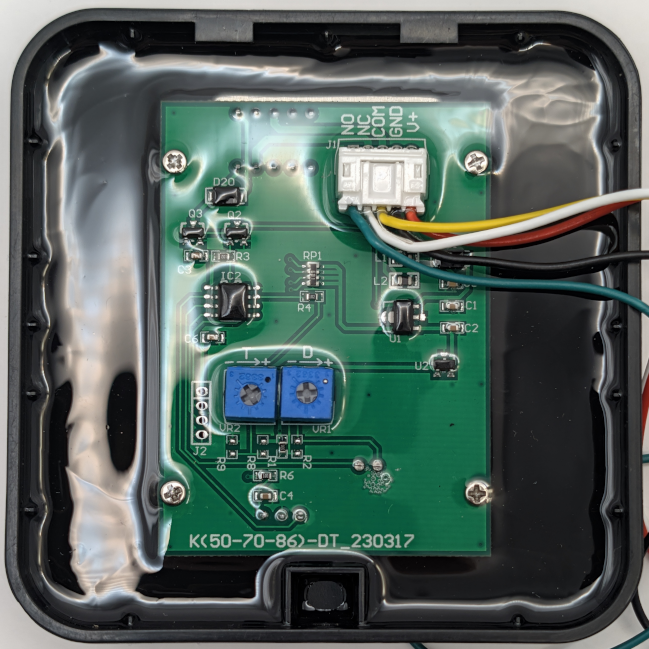

### Device Description

This RTE-WIR is a sensor sold by the company CDVI. The sensor is a stainless steel fronted plastic case with an illuminated waving hand logo cut into the stainless steel. Two holes below the logo are for the IR led and receiver.
The CDVI company logo is etched into the stainless at the bottom right corner.
The pcb is marked with the silkscreen K(50-70-86)-DT_230317 and is potted in transparent resin.

### Source

Provided by [en4rab](https://twitter.com/en4rab)/[en4rab](https://github.com/en4rab). Purchased from Ebay August 2026

### Signal Pattern

The signal pattern has not yet been measured however preliminary testing found the sensor would trigger when presented with the same signal as the NT1 sensor.
Recording and playing back the signal with a flipper zero was also able to trigger the sensor.

##### irplot.py data

##### irplot.py trace

### Images

