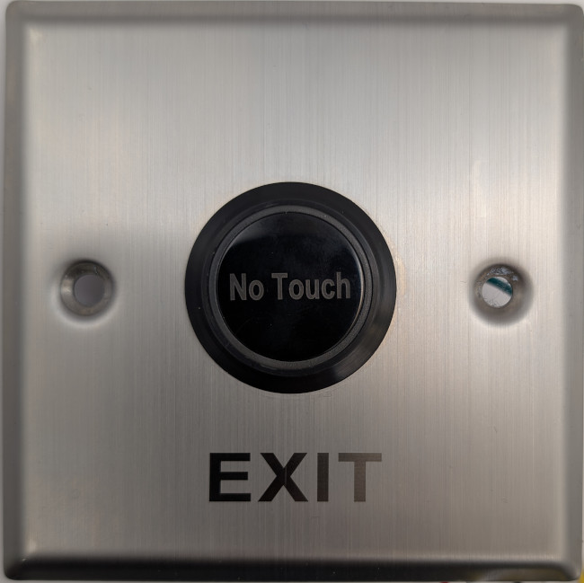
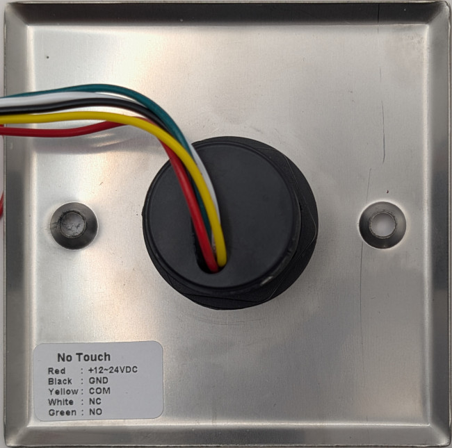

### Device Description

The XM-EI01B is a small round black plastic sensor mounted in a thin pressed stainless plate. 
The sensor filter has "No Touch" printed on it and the stainless plate has "EXIT" polished into it at the bottom.
This sensor appears to be a style variant of the NT1/K4 as it triggers with the same signal as the NT1

### Source

Provided by [@en4rab](https://twitter.com/en4rab)/[en4rab](https://github.com/en4rab). Purchased from AliExpress in August 2025.

### Signal Pattern

The signal has not been directly measured for this model however it triggers using the same signal that operates NT1/K4/K10 so is assumed to be another variant

### Images

