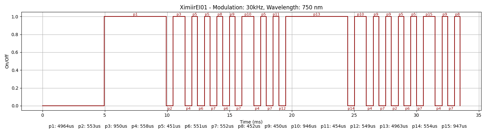

### Device Description

Another cheap device off AliExpress/eBay with a thin steel shell. Probably made by [Ximi Technology](http://www.ximitechnology.com/index_en.html)

### Source

Provided by [@therealshodan](https://twitter.com/therealshodan)/[i-am-shodan](https://github.com/i-am-shodan). Purchased from eBay in 2025.

### Signal Pattern

Signal is a simple repeating pattern with a spacing of 51300uS. 

A pulseview recording made using a logic analyser connected to the TX/RX lines of the device and a TSMP98000 recieving the infrared signal can be found in the [/salae/XimiirEI01](/salae/XimiirEI01) directory.

##### irplot.py data
```
30kHz, 750 nm, XimiirEI01, 1, 4964us, 553us, 950us, 558us, 451us, 551us, 451us, 552us, 452us, 551us, 450us, 552us, 946us, 558us, 451us, 552us, 454us, 549us, 4963us, 554us, 946us, 558us, 450us, 552us, 450us, 553us, 451us, 551us, 451us, 552us, 947us, 558us, 450us, 552us, 452us
```

##### irplot.py trace


### Images


