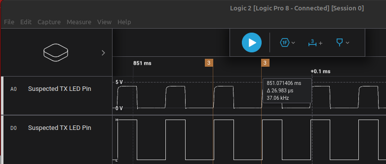
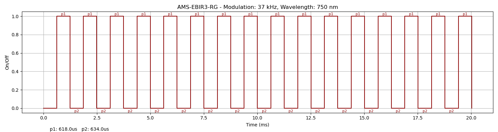

### Device Description

This device is strikingly similar to the NT200. While there clearly some differences, the layout of the PCB and signal pattern are almost identical. Speculate that they are made by the same OEM, one is a knock off of the other, or both are a knock off a third device.

### Source

[R3n5sk1](https://twitter.com/R3n5k1)/[CR-DMcDonald](https://github.com/CR-DMcDonald), tested 1 device marked AMS-EBIR3-RG, DOM: 03/24 in 2024.

### Signal Pattern

The signal is a series of 15 identical pulses, with an on off time of 618us, 634us. The modulation was measured at 37 kHz. There is a ~22.6ms gap between each series of pulses.



##### irplot.py data
```
37 kHz, 750 nm, AMS-EBIR3-RG, 15, 618us, 634us
```

##### irplot.py trace
