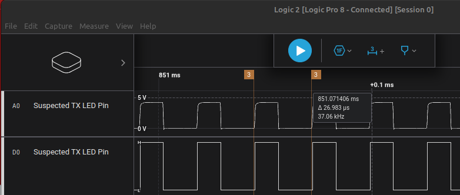
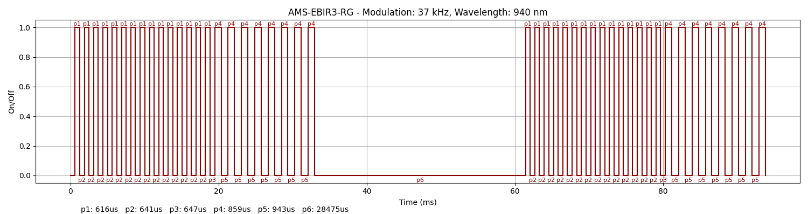

### Device Description

This device is strikingly similar to the NT200. While there clearly some differences, the layout of the PCB and signal pattern are almost identical. Speculate that they are made by the same OEM, one is a knock off of the other, or both are a knock off a third device.

### Source

[R3n5sk1](https://twitter.com/R3n5k1)/[CR-DMcDonald](https://github.com/CR-DMcDonald), tested 1 device marked AMS-EBIR3-RG, DOM: 03/24 in 2024.  
[@en4rab](https://twitter.com/en4rab)/[en4rab](https://github.com/en4rab), tested 1 device marked AMS-EBIR3-RG, DOM: 03/24 in 2026.

### Signal Pattern

The signal is a series of 15 identical pulses, with an on off time of 616us, 641us. The modulation was measured at 37 kHz. There is a ~22.6ms gap between each series of pulses.
If the sensor detects all 15 pulses reflected back it sends an additional 8 slightly longer pulses with an on time of 859us and an off time of 943us.  
This seems to be the same signal as the NT200 but with a slightly higher clock freq for the microcontroller. Its unknown if this is by design or just variation in microcontrollers but 2 devices have been tested to have 37 kHz modulation compared to 36.2 kHz for the NT200.



A pulseview recording of the sensor being opened several times can be found in the [/sigrok/ams-ebir3-rg](/sigrok/ams-ebir3-rg) directory.

##### irplot.py data
```
37 kHz, 940 nm, AMS-EBIR3-RG, 1, 616us, 641us, 616us, 641us, 616us, 641us, 616us, 641us, 616us, 641us, 616us, 641us, 616us, 641us, 616us, 641us, 616us, 641us, 616us, 641us, 616us, 641us, 616us, 641us, 616us, 641us, 616us, 641us, 616us, 647us, 859us, 943us, 859us, 943us, 859us, 943us, 859us, 943us, 859us, 943us, 859us, 943us, 859us, 943us, 859us, 28475us, 616us, 641us, 616us, 641us, 616us, 641us, 616us, 641us, 616us, 641us, 616us, 641us, 616us, 641us, 616us, 641us, 616us, 641us, 616us, 641us, 616us, 641us, 616us, 641us, 616us, 641us, 616us, 641us, 616us, 647us, 859us, 943us, 859us, 943us, 859us, 943us, 859us, 943us, 859us, 943us, 859us, 943us, 859us, 943us, 859us
```

##### irplot.py trace


### Spectrum

Not been able to identify the IR signal on this device.

### Images

