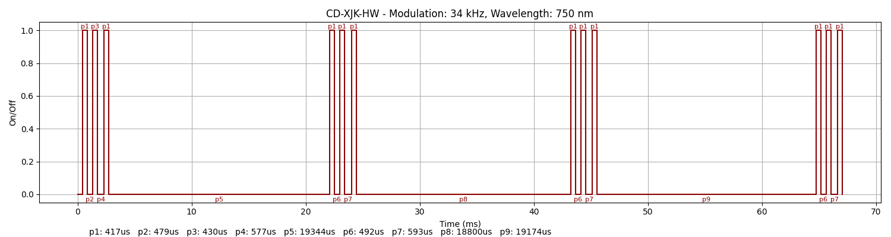
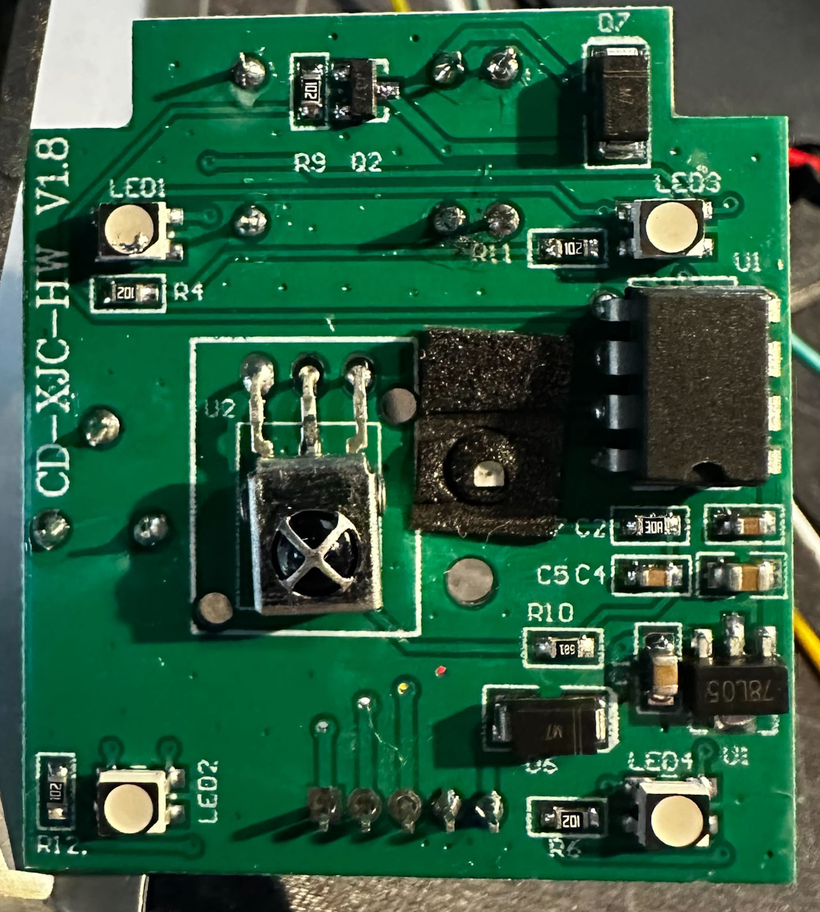

### Device Description

Another cheap device off AliExpress with a plastic shell. 

### Source

Provided by [@therealshodan](https://twitter.com/therealshodan)/[i-am-shodan](https://github.com/i-am-shodan). Purchased from AliExpress in 2025.

### Signal Pattern

Just like the NT200 this sensor can be opened with a static pattern, but timing is crucial. Even with the right delays it can take 20s or more for the patterns to align correctly.

Four correctly aligned messages are needed to open the device. Each message is composed of three pulses with a carrier of ~34000Khz. On time is usually 417uS with off time varing but generally being 492uS. A 19ms gap between messages is used by the device. In order to open it you will need to use a shorter value to force signal alignment.

A pulseview recording made using a logic analyser connected to the TX/RX lines of the device and a TSMP98000 recieving the infrared signal can be found in the [/sigrok/cd_xjk_hw](/sigrok/nt1) directory. 

A signal needs to be recieved with around 57uS after transmit. When the device doesn't detect a reflect it will stop sending the rest of the code. As a result looking at purely the infrared results the messages of 1,2 and 3 pulses can appear like a rolling code. These pulses actually mean:
* A single pulse tells you a reflected response was not observed in the right window
* Two pulses mean a signal was receieved but was out of alignment
* The signal was successfully recieved and should be aligned

##### irplot.py data
```
34 kHz, 750 nm, CD-XJK-HW, 1, 417us, 479us, 430us, 577us, 417us, 19344us, 417us, 492us, 417us, 593us, 417us, 18800us, 417us, 492us, 417us, 593us, 417us, 19174us, 417us, 492us, 417us, 593us, 417us
```

##### irplot.py trace


### Images



