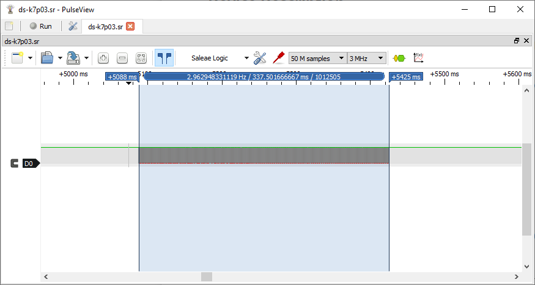
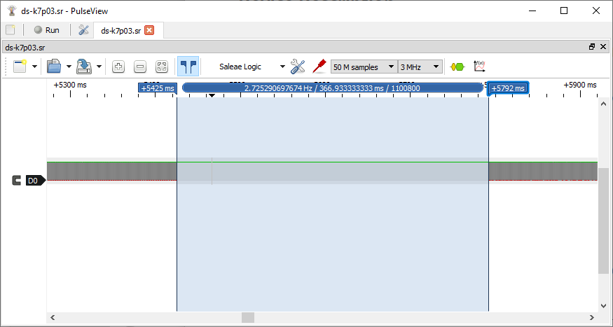
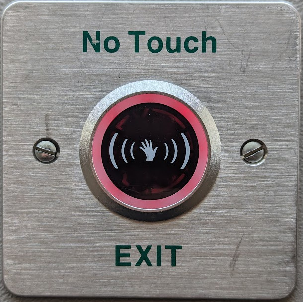

### Device Description

The Hikvision DS-K7P03 (and it's slimline variant DS-K7P04) have a circular metal bezel with a frosted look around the IR filter. The filter has a distinctive (((🖐))) print. The internal light bleed is sufficient that the internal pcb can just be seen.

It is suspected that [yli.cn](https://www.yli.cn/en/product/Button/Infrared-Sensor/) might be the OEM for this sensor but that is not proven.

### Source

Provided by [en4rab](https://twitter.com/en4rab)/[en4rab](https://github.com/en4rab).

### Signal Pattern

The timing of the signal seemed to vary, with the duration being between 336uS and 342uS, but it was always 10000 cycles. 

The frequency was about 29.63 kHz with an on time of 337.5 mS (10000 cycles) and an off time of 366.9 mS.

Each burst is 10000 pulses long.

366.9mS between pulses

A pulseview recording made using a TSMP58000 of this signal can be found in the [/sigrok/ds-k7p03](/sigrok/ds-k7p03) directory.

### Images

