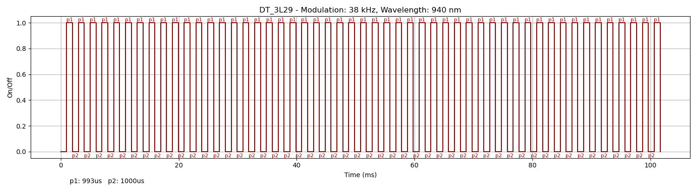
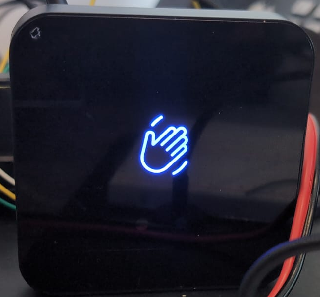
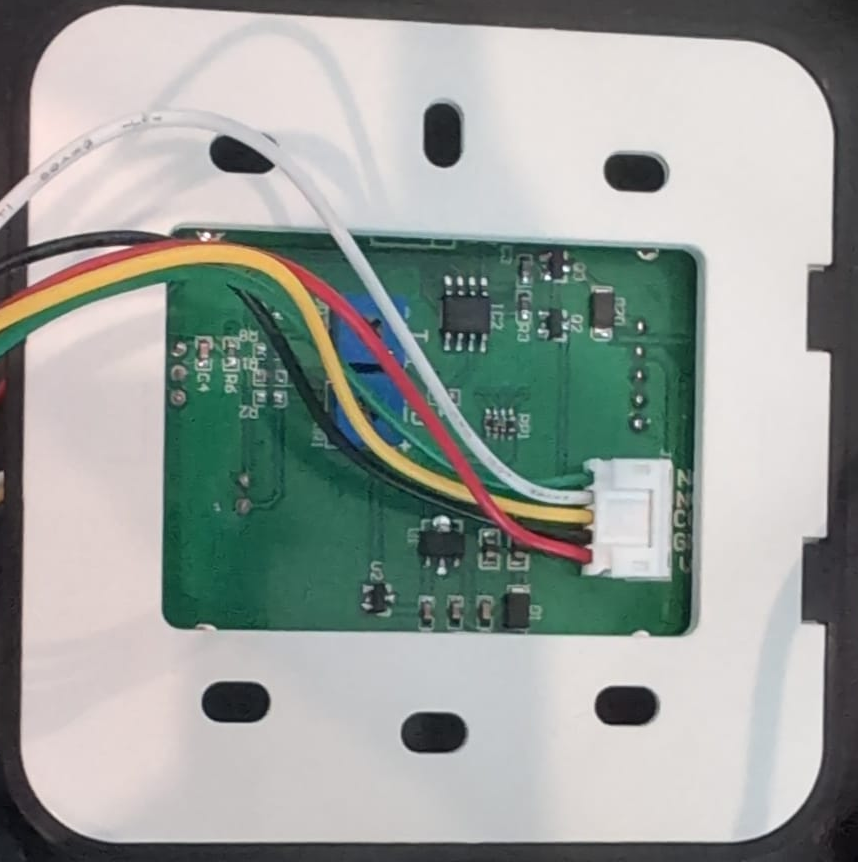
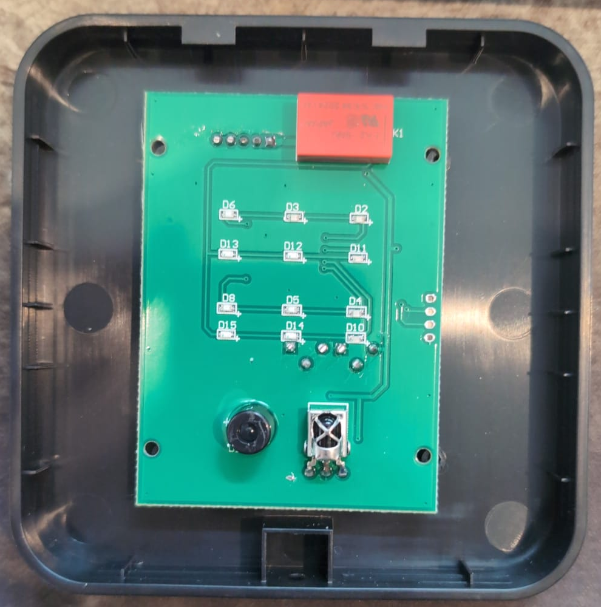
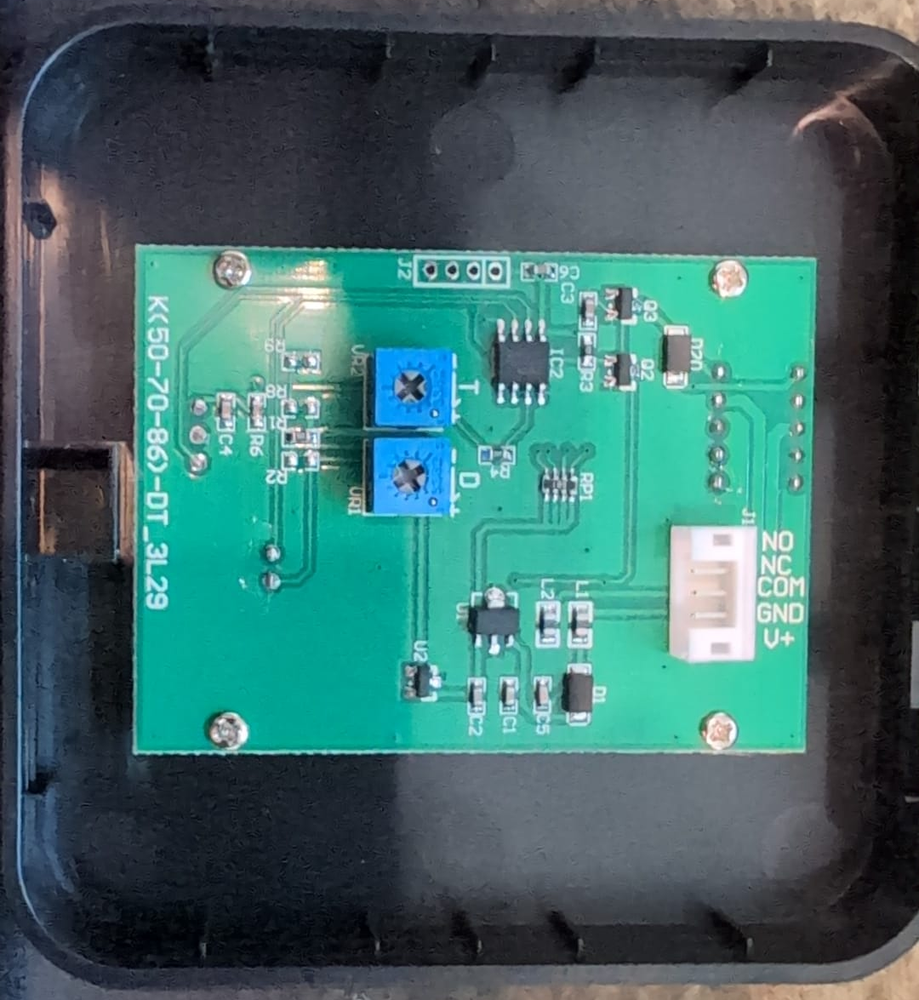

### Note on name

Model might be wrong, DT_3L29 was printed on the circuit board. No other marking indicating an OEM or model number though.

### Device Description

Comes in white or black, has a distinctive pair of dots on the front for the IR TX/RX though these are much more noticable on the white version.

### Sources

[R3n5sk1](https://twitter.com/R3n5k1)/[CR-DMcDonald](https://github.com/CR-DMcDonald), tested 1 device in 2024.

### Signal Pattern

Measured on the PINs of the IR LED, not yet verified with a replay. 38 kHz modulation with a 20% duty cycle. Simple 50 pulse pattern with a ~993 us/1 ms on/off time. Following the final on of pattern, there is a 101.8 ms pause before the next series of 50.

Triggering the sensor causes no change to the output.

##### irplot.py data
```
38 kHz, 750 nm, DT_3L29, 50, 993us, 1000us
```

##### irplot.py trace


### TODO

* Very obvious JTAG connection might be worth checking out
* Obtain spectrum of IR LED
* Test replay
* Find out what the IC is and find datasheet. Quick google revealed nothing.

### Images




