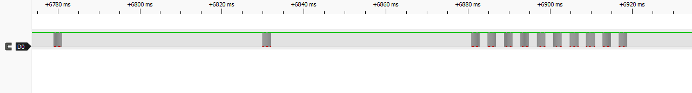
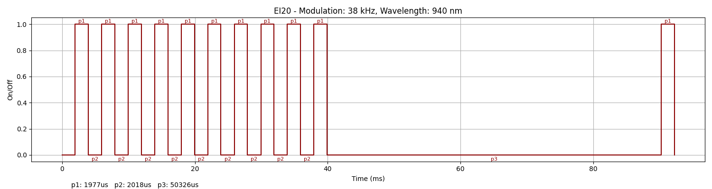
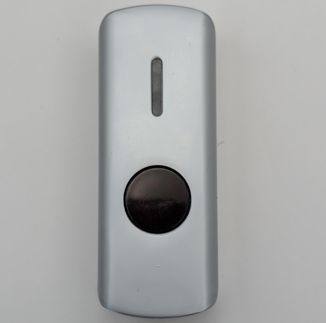
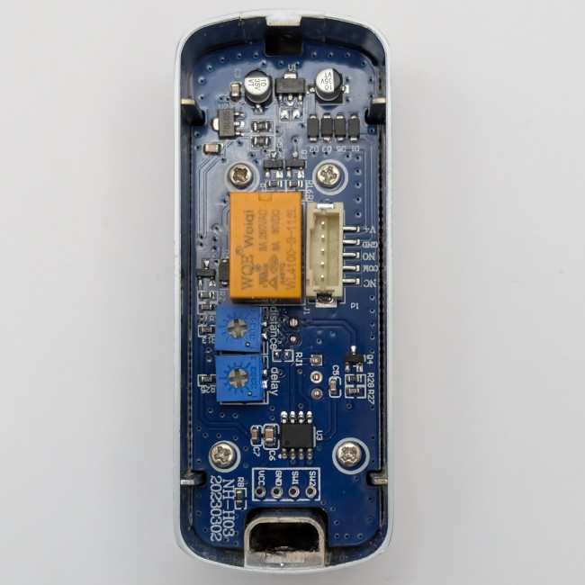

### Device Description

This device is a slimline stainless case with the status LED as a vertical line above a round IR sensor window.  
the AliExpress advert suggested the OEM manufacturer was Ximi and provided the [model code of EI20](https://ximiir.com.cn/no-touch-exit-button/309.html)  
The device and box did not have any model information but the pcb was marked NH-H03 on the silkscreen. 

### Source

Provided by [en4rab](https://twitter.com/en4rab)/[en4rab](https://github.com/en4rab). Purchased from AliExpress in 2026.

### Signal Pattern

The modulation frequency was about 38Khz While it is searching for a reflected signal it sends a single pulse with on time of 1977 uS and an off time of 48923 uS.  
When a hand is detected the sensor switches to sending bursts of 10 pulses with an on time of 1977 uS an off time of 2018 uS and a gap between groups of ten pulses of 50326 uS  
Sending this pattern of 10 pulses triggered the sensor.



A pulseview recording made using a TSMP98000 of this signal can be found in the [/sigrok/ei20](/sigrok/ei20) directory. 

##### irplot.py data
```
38 kHz, 940 nm, EI20, 1, 1977us, 2018us, 1977us, 2018us, 1977us, 2018us, 1977us, 2018us, 1977us, 2018us, 1977us, 2018us, 1977us, 2018us, 1977us, 2018us, 1977us, 2018us, 1977us, 50326us
```

##### irplot.py trace


### Images




