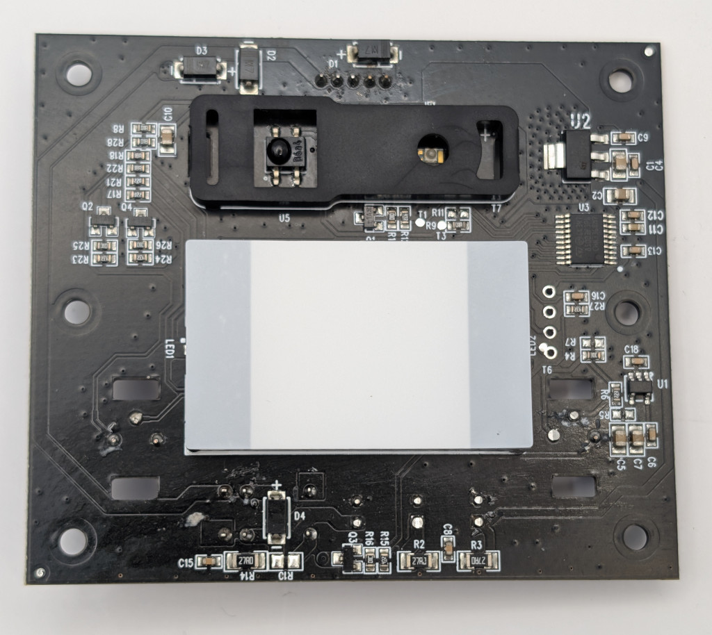
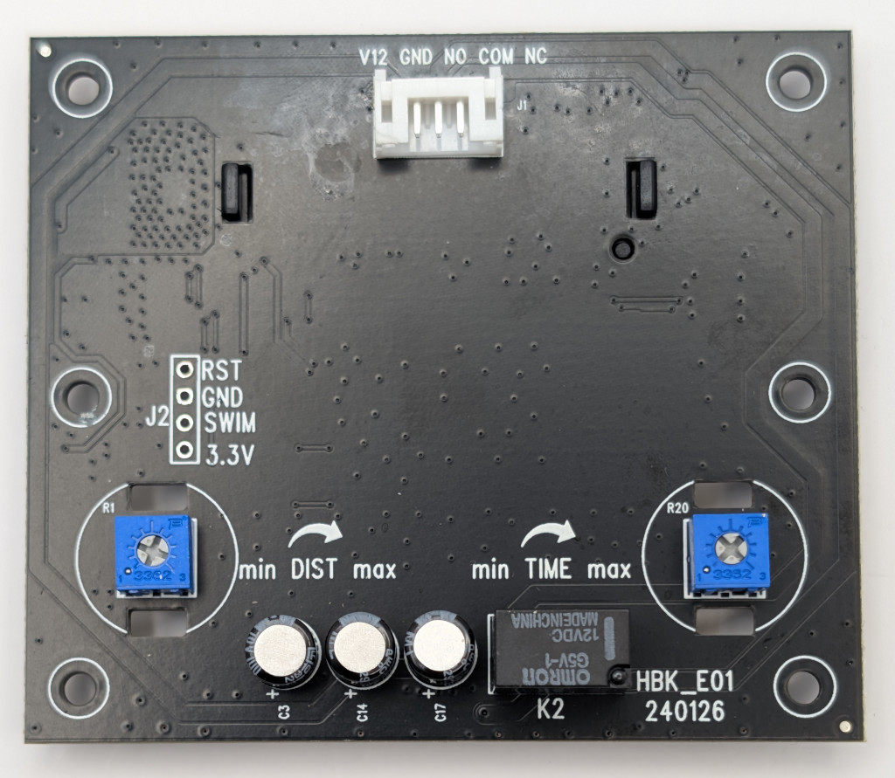

### Device Description

Unlike the nearly visually identical HBK-EO2 the E01 is an IR based device. The enclosure is the same moulding as the E02. It was found being sold under the brand Uhppote.

Enclosure is marked Shenzhen HOBK Electronic Technology Co. Ltd, presumably the OEM.

### Sources

[en4rab](https://twitter.com/en4rab)/[en4rab](https://github.com/en4rab), tested 1 device. Purchased from Amazon UK in 2026.

### Testing

* The sensor was briefly powered up and a quick test showed it responded to the signals that triggered the nt1, nt200 and ams-ebir3-rg 

* A further test with a TV remote control showed the sensor would trigger on any ~38kHz modulated signal as two different TV remotes could open it

* When time allows the actual signal will be recorded but this device is so indiscriminate an accurate signal reproduction is not necessary.

  

### Images

### Teardown

