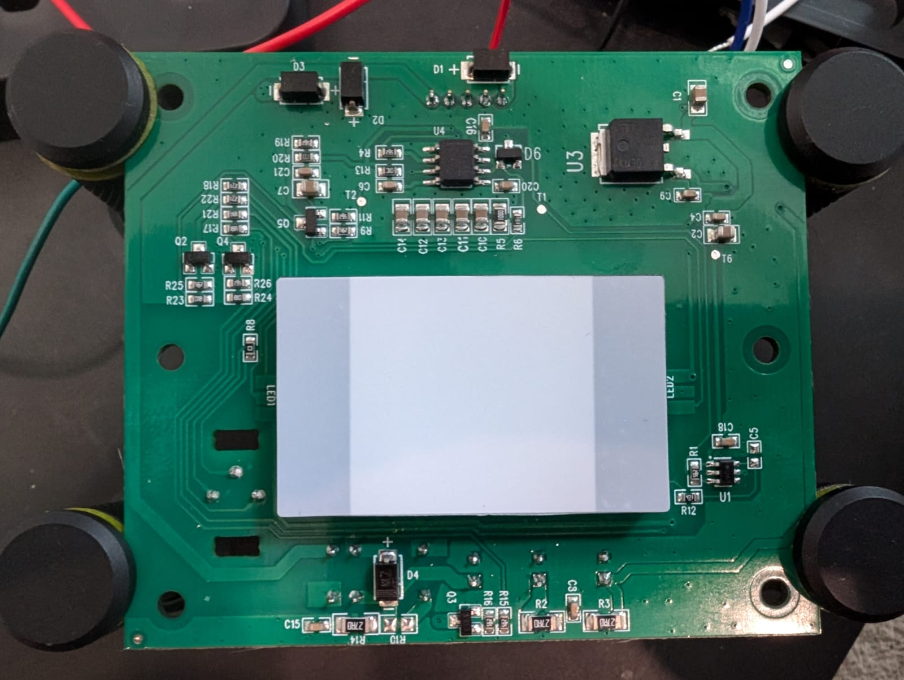
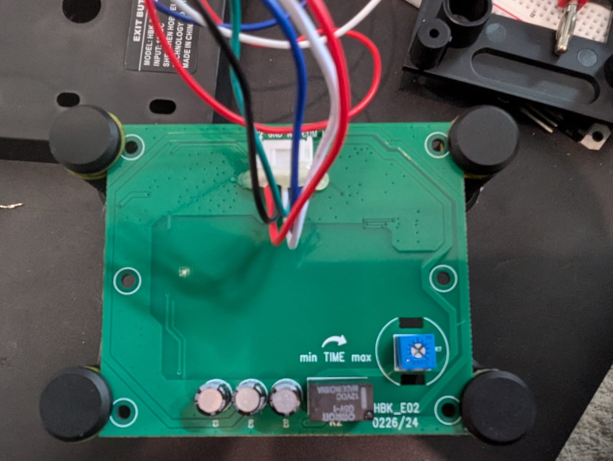

### Device Description

This is not an IR based device, uses a capacitive sensor. OEM is Shenzhen HOBK Electronic Technology Co. Ltd.

### Sources

[R3n5sk1](https://twitter.com/R3n5k1)/[CR-DMcDonald](https://github.com/CR-DMcDonald), tested 1 device. Purchased from Amazon UK in 2024.

### Testing

Briefly exposed it to low power, narrow band 1.25-2.50 Mhz EMI close range with HackRF, no impact.

### Images

### Teardown

* U1 is a [BS812A-1 12A-1](https://www.holtek.com/page/vg/BS814A-1), driving the capacitive sensor plane under the light box through R12.

