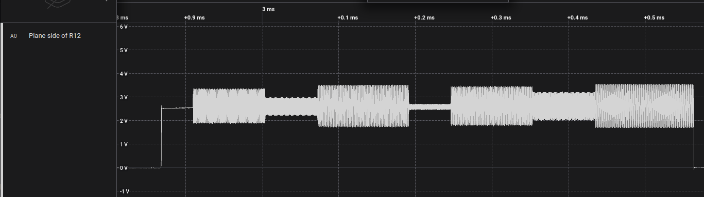
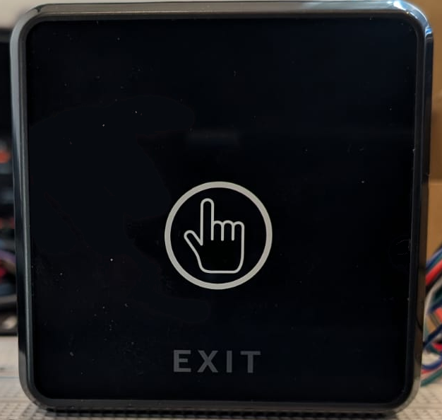
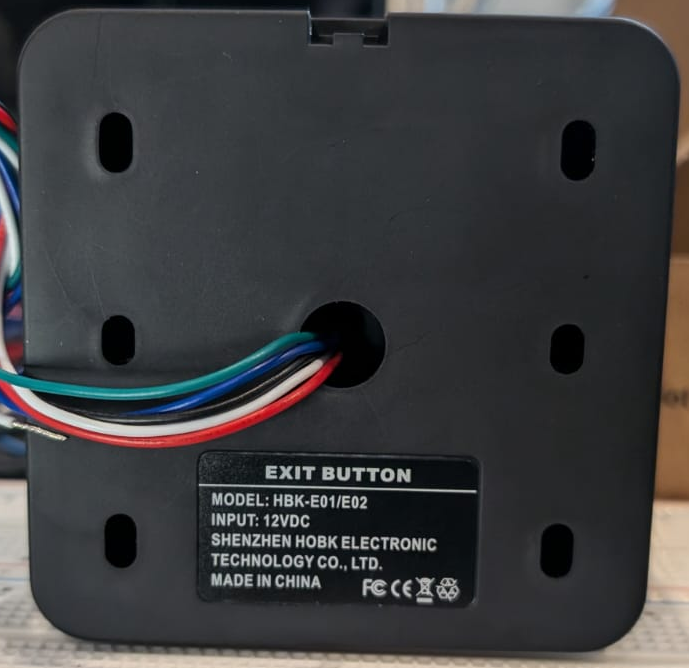
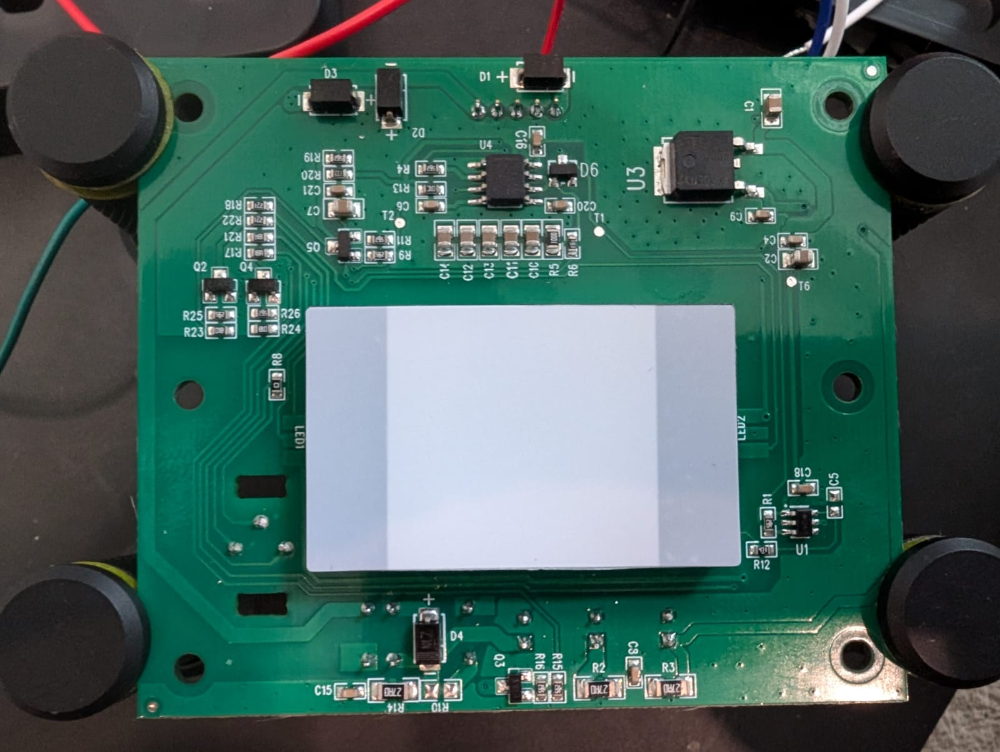
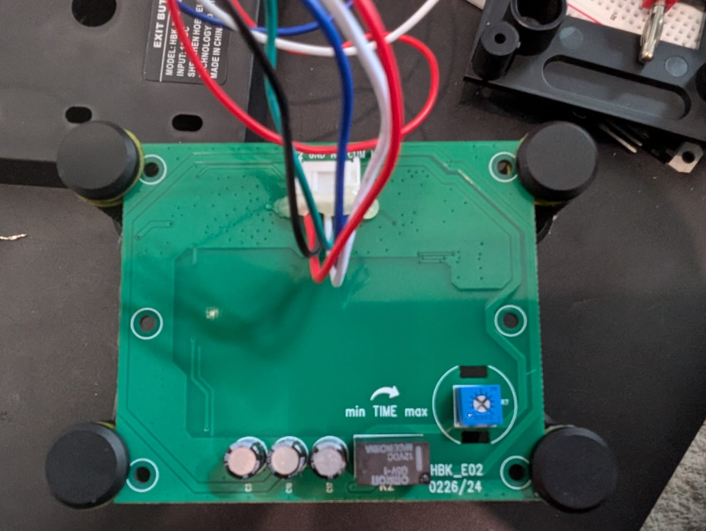

### Device Description

This is not an IR based device and instead uses a capacitive sensor. The enclosure has marking showing where the dial to change an IR distance is, perhaps indicating the is another version of this that did use IR.

Enclosure is marked Shenzhen HOBK Electronic Technology Co. Ltd, presumably the OEM.

### Sources

[R3n5sk1](https://twitter.com/R3n5k1)/[CR-DMcDonald](https://github.com/CR-DMcDonald), tested 1 device. Purchased from Amazon UK in 2024.

### Testing

* Briefly exposed it to low power, narrow band 1.25-2.50 Mhz EMI close range with HackRF, no impact.
* Measured signal at R12, each signal contains seven different modulations, all roughly around 1-3 Mhz.

### Images

### Teardown

* U1 is a [BS812A-1 12A-1](https://www.holtek.com/page/vg/BS814A-1), driving the capacitive sensor plane under the light box through R12.
* U3 is heat sink is connected to ground

