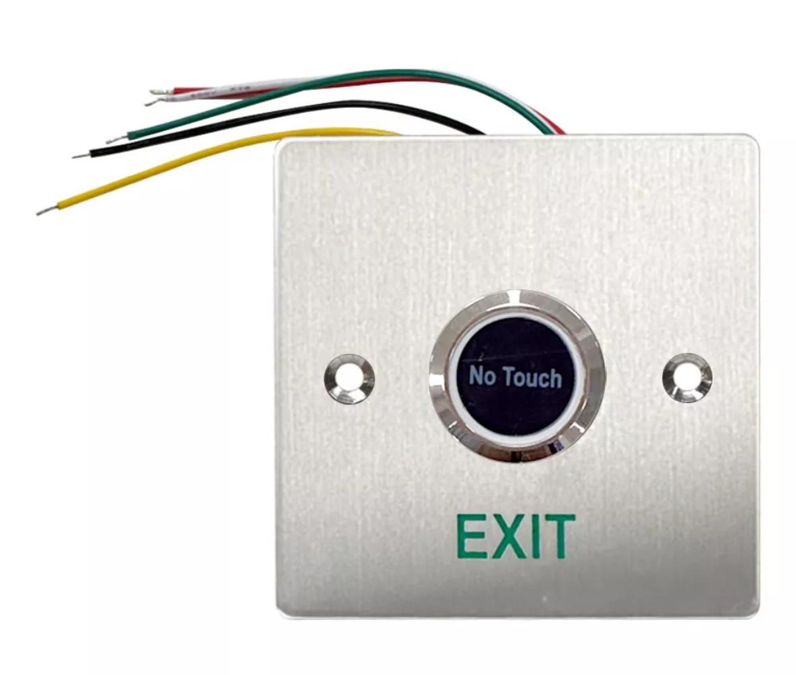
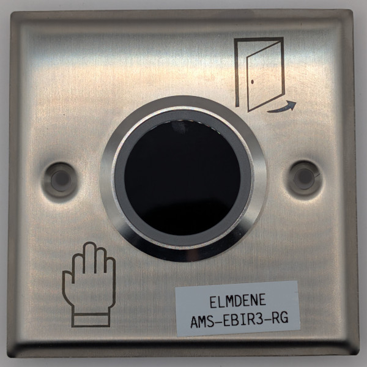
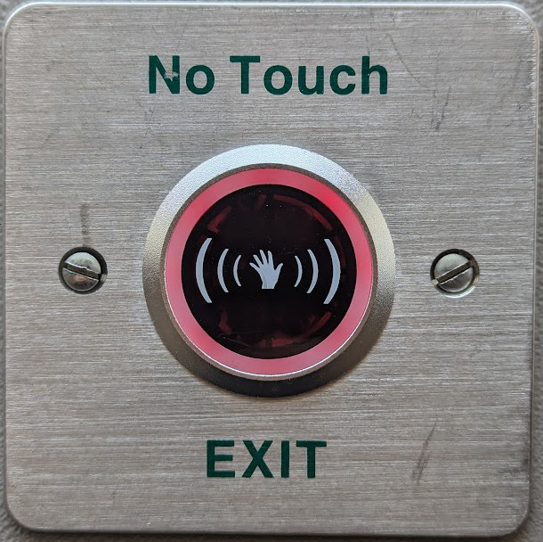
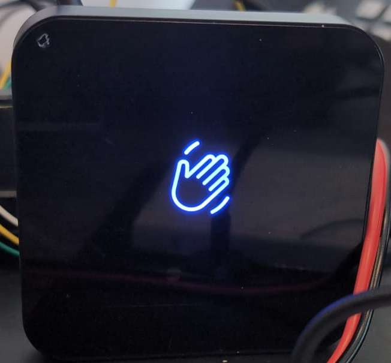
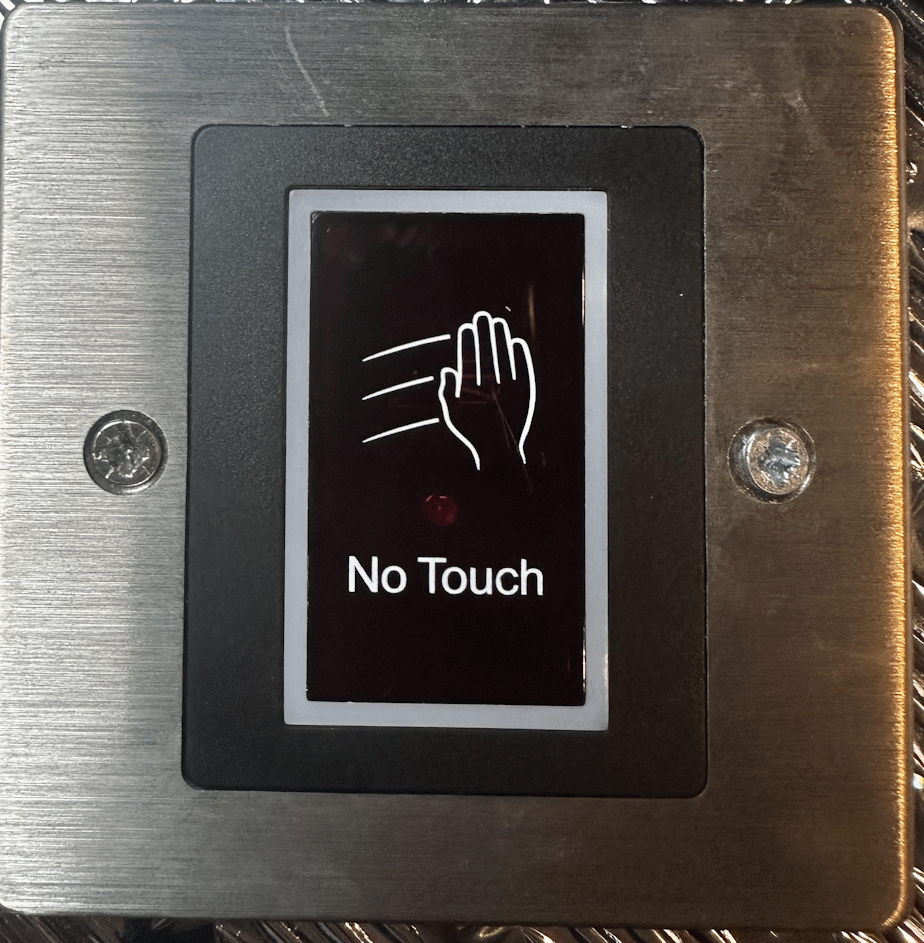
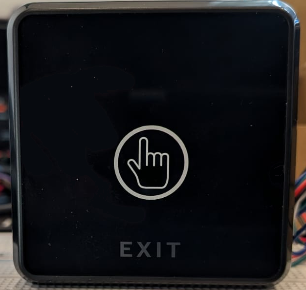
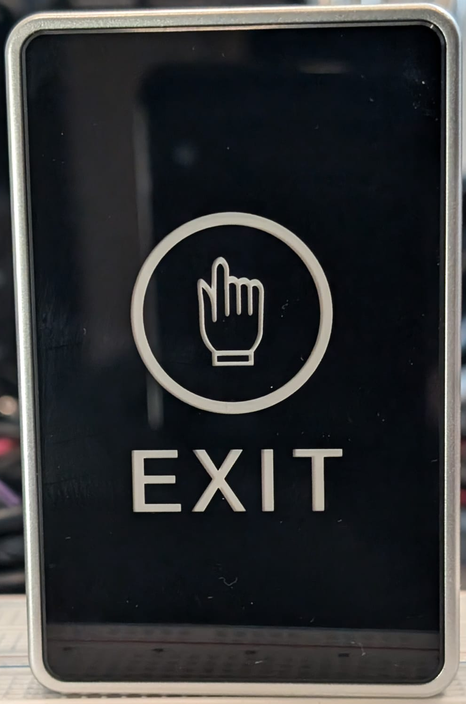

# Sensor Spotting

While its it not possible to ID a sensor by sight with 100% accuracy it is very helpful to narrow down the possible types. 

This grid should help you ID the sensor by picture:

<table>
 <tr>
  <td style='text-align:center;width:50%;'>
   <figure>
   <figcaption>XimiirEI01</figcaption>
   </figure>
  </td>
  <td style='text-align:center;width:50%;'>
   <figure>
   <figcaption>ams-ebir3-rg</figcaption>
   </figure>
  </td>
 </tr>
 <tr>
  <td style='text-align:center;width:50%;'>
   <figure>
   <figcaption>NT100 or NT1 or cd_xjk_hw 
   The shell seems to be used by several sensors
   </figcaption>
   </figure>
  </td>
  <td style='text-align:center;width:50%;'>
   <figure>
   <figcaption>DS-K7P03</figcaption>
   </figure>
  </td>
 </tr>   
 <tr>
  <td style='text-align:center;width:50%;'>
   <figure>
   <figcaption>dt_3129</figcaption>
   </figure>
  </td>
  <td style='text-align:center;width:50%;'>
   <figure>
   <figcaption>ebnt_tf_3</figcaption>
   </figure>
  </td>
 </tr>
 <tr>
  <td style='text-align:center;width:50%;'>
   <figure>
   <figcaption>ebutton3</figcaption>
   </figure>
  </td>
  <td style='text-align:center;width:50%;'>
   <figure>
   <figcaption>SP80NT</figcaption>
   </figure>
  </td>
 </tr>
 <tr>
  <td style='text-align:center;width:50%;'>
   <figure>
   <figcaption>NT200</figcaption>
   </figure>
  </td>
  <td style='text-align:center;width:50%;'>
   <figure>
   <figcaption>smb-i016</figcaption>
   </figure>
  </td>
 </tr>
 <tr>
  <td style='text-align:center;width:50%;'>
   <figure>
   <figcaption>hbk-e02 
   Not an IR sensor!
   </figcaption>
   </figure>
  </td>
  <td style='text-align:center;width:50%;'>
   <figure>
   <figcaption>unknown-00 
   Not an IR sensor
   </figcaption>
   </figure>
  </td>
 </tr>

