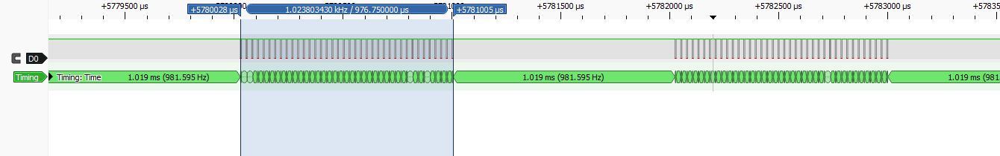
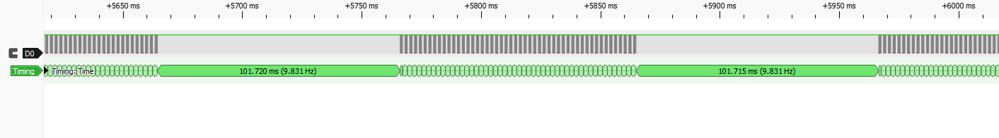
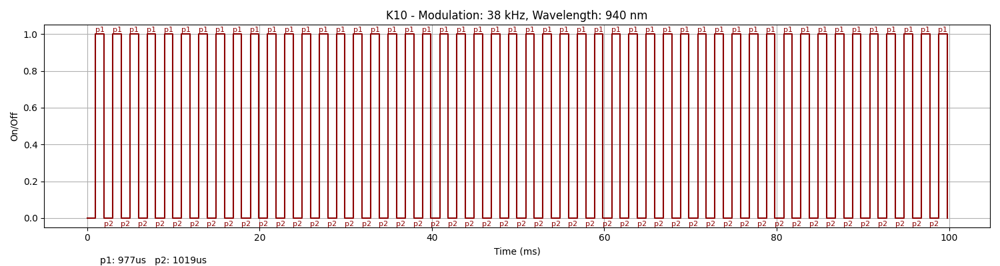
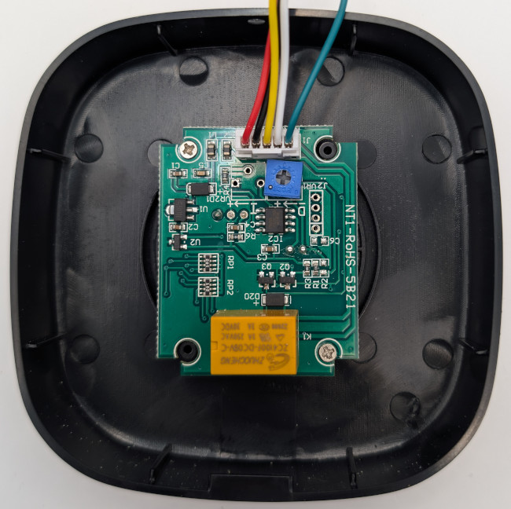

### Device Description

The K10 Request to Exit sensor is a matt black rounded square with a central round sensor section surrounded by an led indicator ring. The sensor filter has a (🖐) printed on it.
This sensor appears to be a style variant of the NT1/K4 as it uses the same signal as the NT1 and the pcb is marked NT1-RoHs-5B21

### Source

Provided by [@en4rab](https://twitter.com/en4rab)/[en4rab](https://github.com/en4rab). Purchased from AliExpress in August 2025.

### Signal Pattern

The modulation frequency was about 38Khz with on time of 977 uS and an off time of 1019 uS.  

A message is composed of 49 or 50 pulses and there is a 101.6ms gap between messages.  


A slightly noisy pulseview recording of this signal can be found in the [/sigrok/k10](/sigrok/k10) directory. 

##### irplot.py data
```
38 kHz, 940 nm, K10, 49, 977us, 1019us
```

##### irplot.py trace


### Images



