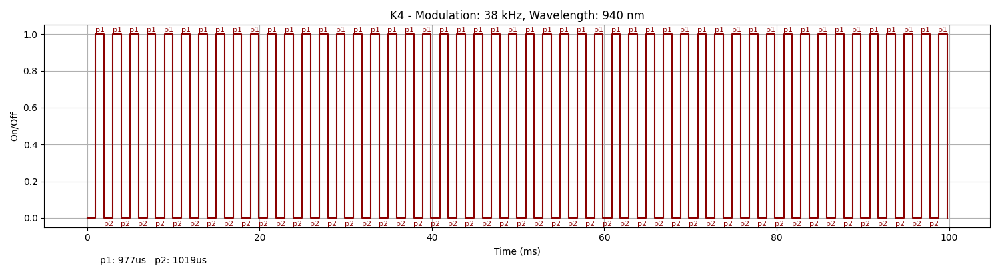

### Device Description

The K4 Request to Exit sensor is a square, white-cased module with a glossy black inner surface features a white outline of a hand and concentric rings. The status led is in the top left with the concentric rings radiating out from it.  
This sensor appears to use the same signal as the NT1 

### Source

Provided by [@en4rab](https://twitter.com/en4rab)/[en4rab](https://github.com/en4rab). Purchased from AliExpress in August 2025.

### Signal Pattern

The modulation frequency was about 38Khz with on time of 977 uS and an off time of 1019 uS. 
A message is composed of 49 or 50 pulses and there is a 101.6ms gap between messages.

A pulseview recording of this signal can be found in the [/sigrok/k4](/sigrok/k4) directory. 

##### irplot.py data
```
38 kHz, 940 nm, K4, 49, 977us, 1019us
```

##### irplot.py trace


### Images


