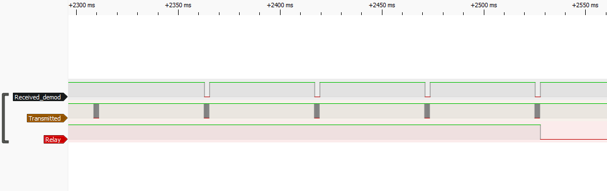

### Device Description

Another cheap device off AliExpress with a plastic shell. 

### Source

Provided by [@en4rab](https://twitter.com/en4rab). Purchased from AliExpress in 2025.

### Signal Pattern

The K8W-TD has a very simple fixed pattern, but it is very fussy about timing. Even with the right delays it can take 30s or more for the patterns to align correctly.

Four correctly aligned pulses are needed to open the device. Each pulses has a carrier of ~39000Khz.  On time is 2564 uS with off time being 51687 uS.  

The sensor seems to check for the absence of a signal in the off time and during testing was seen to ignore a match because of noise and need 5 matches before it opened. Testing sending 5 correctly times pulses in a row with the expectation that the first would be ignored due to bad timing then the next 4 would match seemed to improve the rate of triggering but it was still slow with delays of up to 40s between triggers. 

A pulseview recording made using a logic analyser connected to the TX/RX lines of the device can be found in the [/sigrok/k8w-td](k8w-td) directory. 

