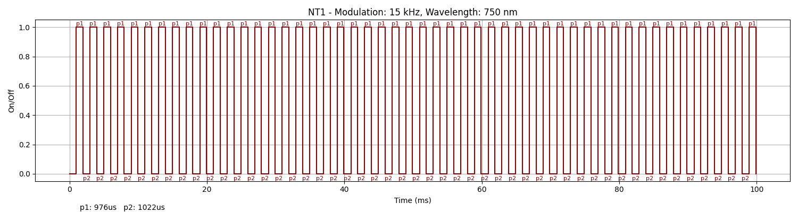
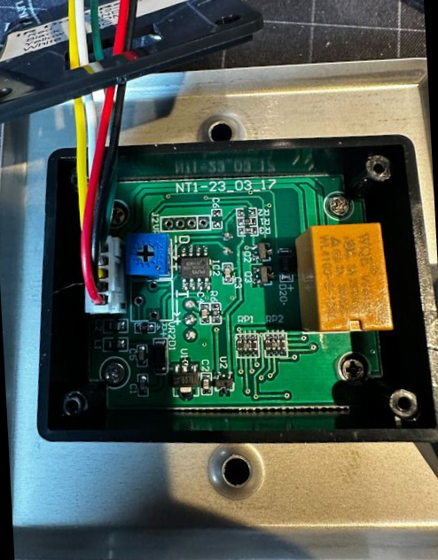

### Device Description

This device seems to have exactly the same enclosure as the [STP-NT100](nt100.md) but a different code. The assumption here is that it may be be a copy of the NT100.

### Source

Provided by [@therealshodan](https://twitter.com/therealshodan)/[i-am-shodan](https://github.com/i-am-shodan). Purchased from AliExpress in 2025.

### Signal Pattern

The modulation frequency was about 15Khz with on time of 976 uS and an off time of 1022 uS. A messages is composed of 49 pulses and there is a 101ms gap between messages.

A pulseview recording made using a TSMP98000 of this signal can be found in the [/sigrok/nt10](/sigrok/nt1) directory. 

##### irplot.py data
```
15 kHz, 750 nm, NT1, 49, 976us, 1022us
```

##### irplot.py trace


### Images



