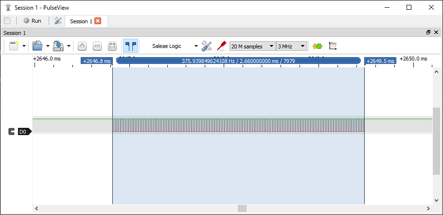
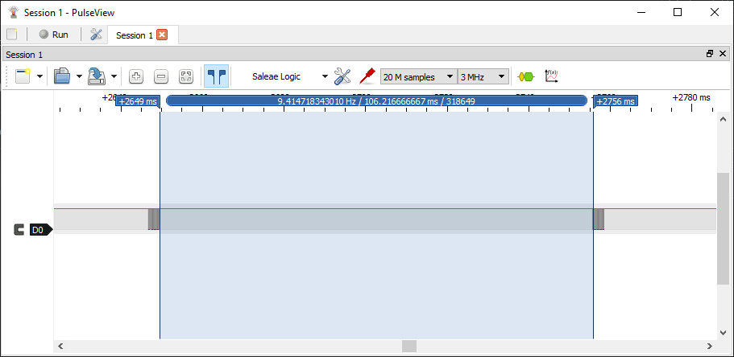

### Device Description

This seems to be one of the earliest models of no touch sensor. It has a distinctive raised black plastic square around the central circular IR filter. As with all sensors it seem to be sold under a variety of part numbers. 

### Source

Provided by [en4rab](https://twitter.com/en4rab)/[en4rab](https://github.com/en4rab).

### Signal Pattern

Roughly 37.59 kHz with on time of 2.66 mS and an off time of 106.2 mS.

Each burst seems to be 100 pulses long. 

106.2 mS between pulses

A pulseview recording made using a TSMP58000 of this signal can be found in the

[/traces/nt100]: /traces/nt100

directory. 

### Images

