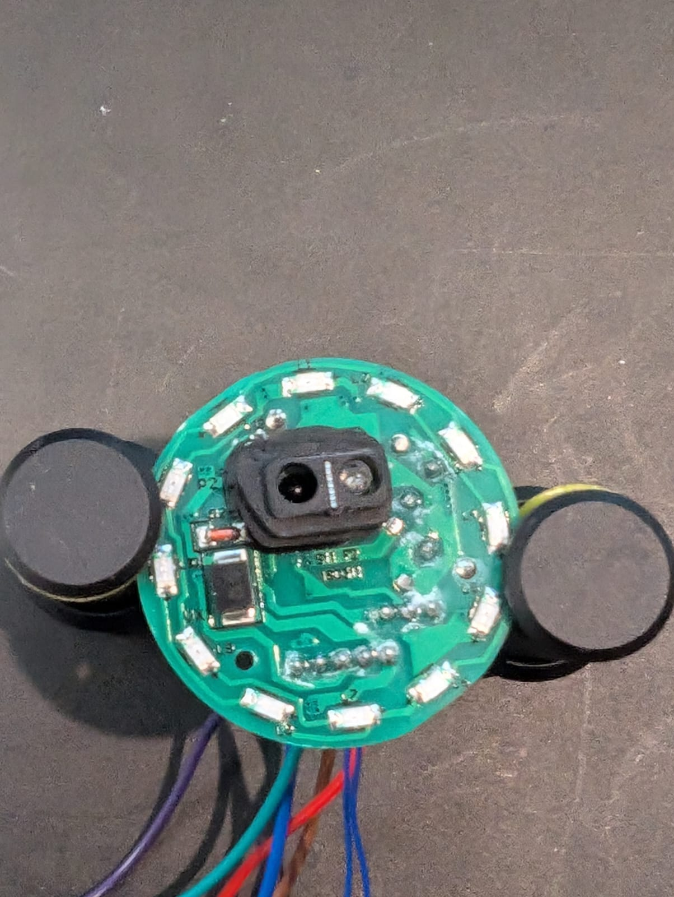
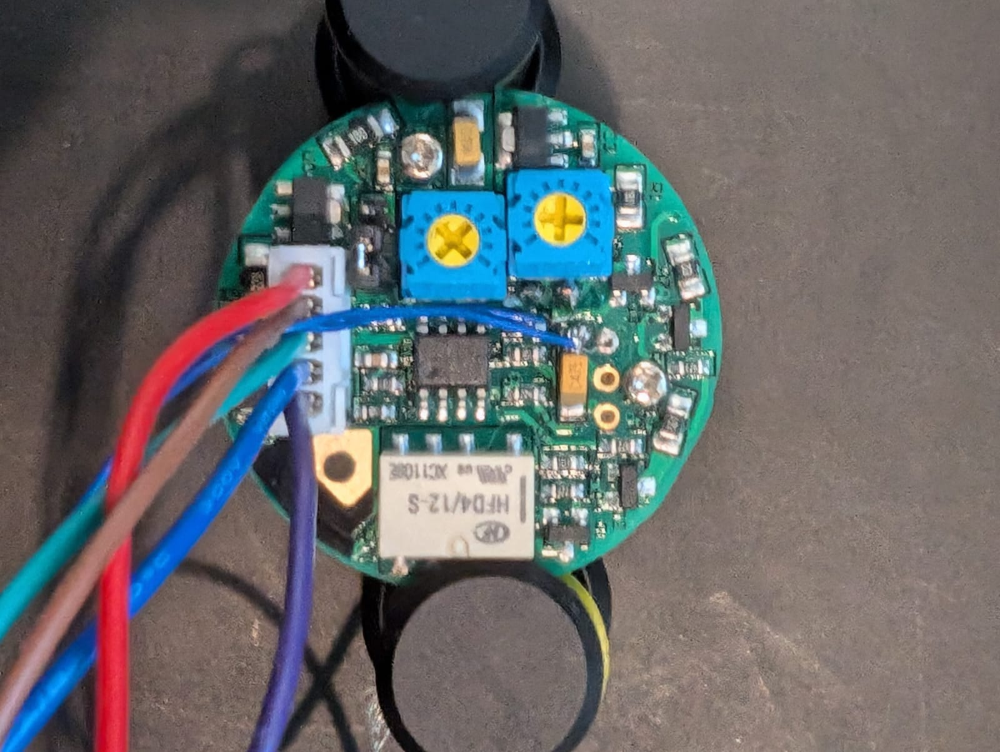

### Device Description

STP-NT200 are very common in the UK and come in several form factors.

### Sources

[R3n5sk1](https://twitter.com/R3n5k1)/[CR-DMcDonald](https://github.com/CR-DMcDonald), tested 3 devices marked STP-NT200 and a 2nd smaller sticker marked Q23-8 in 2024. Purchased from [Acorn Fire Security](https://acornfiresecurity.com/).

### Signal Pattern

These sensors can be opened with a simple static pattern, but it can be a little tricky to get the timing right and you often have to wait 20-30 seconds for you device drift into sync with the NT200.

The pattern required is a series 15 short pulses, followed 8 lightly longer pulses. This whole sequence should be repeated twice. I find it best to leave a small gap otherwise the IR RX sensor on the NT200 can be blinded and stops receiving data.

Using a Saleae connected to the transmit and receive on a NT200 showed the following pattern. Replaying the pattern at 750m, with a modulation of 36.2 kHz triggered the sensors. Mostly tested at 12V, a very quick check at 24V didn't reveal any immediately noticeable differences.

```
const char NT200[] = "swswswswswswswswswswswswswswswlxlxlxlxlxlxlxlPswswswswswswswswswswswswswswswlxlxlxlxlxlxlxlG";

#define NT200_SHORT_PULSE 622;        //s: short pulse duration in microseconds
#define NT200_SHORT_WAIT 654;         //w: short wait duration in microseconds

#define NT200_LONG_PULSE 869;         //l: long pulse duration in microseconds
#define NT200_LONG_WAIT 966;          //x: long wait duration in microseconds

#define NT200_PACKET_PERIOD 28900;    //P: measured using silly scope at 28.947324 ms
const int NT200_SYNC_GAP = 48000;    //G: gap that avoid blinding the sensor and drifts slowly in and out of sync
```

### Images






Note thinner dark blue wires were added during testing