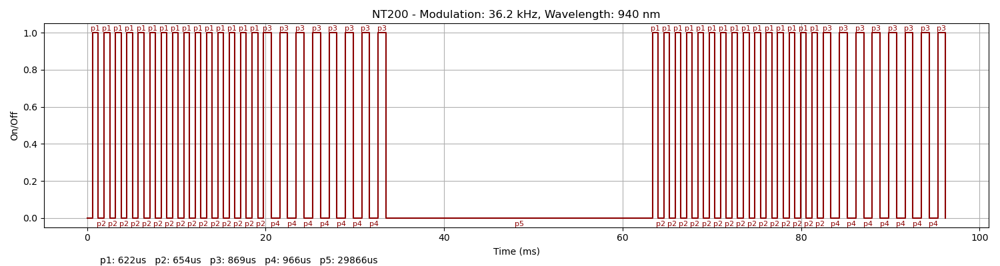

### Device Description

STP-NT200 are very common in the UK and come in several form factors.

### Sources

[R3n5sk1](https://twitter.com/R3n5k1)/[CR-DMcDonald](https://github.com/CR-DMcDonald), tested 3 devices marked STP-NT200 and a 2nd smaller sticker marked Q23-8 in 2024. Purchased from [Acorn Fire Security](https://acornfiresecurity.com/).

### Signal Pattern

These sensors can be opened with a simple static pattern, but it can be a little tricky to get the timing right and you often have to wait 20-30 seconds for you device drift into sync with the NT200.

The pattern required is a series 15 short pulses, followed 8 lightly longer pulses. This whole sequence should be repeated twice. I find it best to leave a small gap (48ms) otherwise the IR rx sensor on the NT200 can be blinded and stops recieving data. This timing is also allows it to roughly fall into sync.

Using a Saleae connected to the transmit and receive on a NT200 showed the following pattern. Replaying the pattern at 750m, with a modulation of 36.2 kHz triggered the sensors. Mostly tested at 12V, a very quick check at 24V didn't reveal any immediately noticeable differences.

Testing of models shows that the below signal sometimes doesnt work. There seems to be enough timing variation between devices that occusionally it doesnt work. More work to be done here, there may be a better average that covers a larger percentage or perhaps couple of patterns will be needed.

##### irplot.py data
```
36.2 kHz, 750 nm, NT200, 1, 622us, 654us, 622us, 654us, 622us, 654us, 622us, 654us, 622us, 654us, 622us, 654us, 622us, 654us, 622us, 654us, 622us, 654us, 622us, 654us, 622us, 654us, 622us, 654us, 622us, 654us, 622us, 654us, 622us, 654us, 869us, 966us, 869us, 966us, 869us, 966us, 869us, 966us, 869us, 966us, 869us, 966us, 869us, 966us, 869us, 29866us, 622us, 654us, 622us, 654us, 622us, 654us, 622us, 654us, 622us, 654us, 622us, 654us, 622us, 654us, 622us, 654us, 622us, 654us, 622us, 654us, 622us, 654us, 622us, 654us, 622us, 654us, 622us, 654us, 622us, 654us, 869us, 966us, 869us, 966us, 869us, 966us, 869us, 966us, 869us, 966us, 869us, 966us, 869us, 966us, 869us
```

##### irplot.py trace


### Images


Note thinner dark blue wires were added during testing