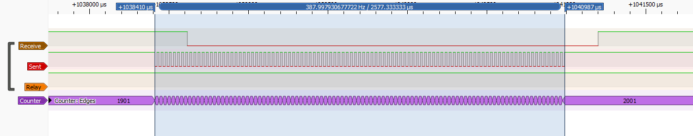
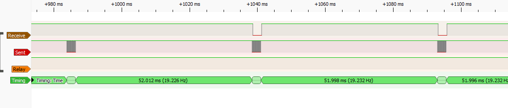
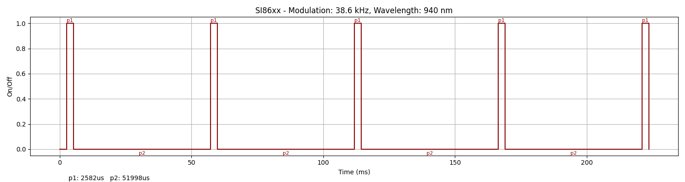
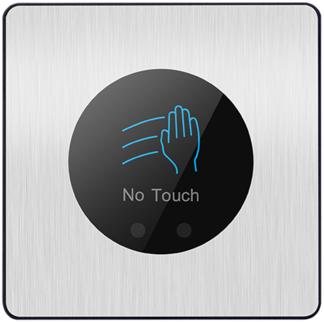
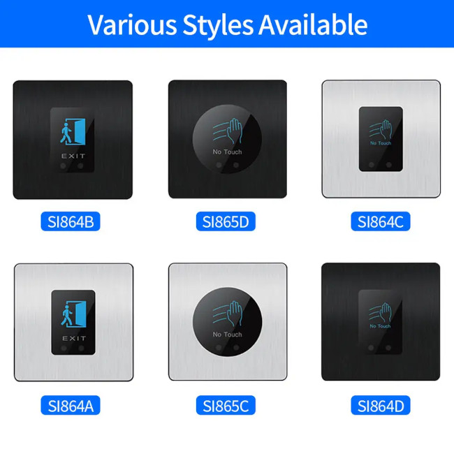

### Device Description

This was listed on AliExpress as SI865C however the PCB has a silkscreen marking 8601PI. Based on the listing it seems to be in a variety of styles, the purchased example was a black plastic rounded square case with a silver brushed aluminium inlaid fascia. The centre a round black logo are with a picture of a hand swiping right that also serves as the status led. The IR send and receive is done through two small round windows at the bottom of the black logo. It also has the text No Touch.  
It seems to be sold under a variety of part numbers with variants having either silver or black brushed aluminium inlay, round or square logo and a swiping hand or person walking through door logo.  
While not tested it is assumes the variants are cosmetic and the signal will likely be the same.

### Source

Provided by [en4rab](https://twitter.com/en4rab)/[en4rab](https://github.com/en4rab). Purchased from AliExpress June 2024

### Signal Pattern

The modulation frequency was about 38.6 kHz with on time of 2.577 mS and an off time of 52 mS.

Each burst seems to be 100 pulses long. 

52 mS between bursts

A pulseview recording of this signal can be found in the [/sigrok/si86xx](/sigrok/si86xx) directory. 

Testing seemed to suggest that 4 matches are required to trigger the door and there is an interference lockout. Simply recording and playing back the signal with a flipper zero would not open the device.

##### irplot.py data
```
38.6 kHz, 940 nm, SI86xx, 4, 2582us, 51998us
```

##### irplot.py trace


### Images



