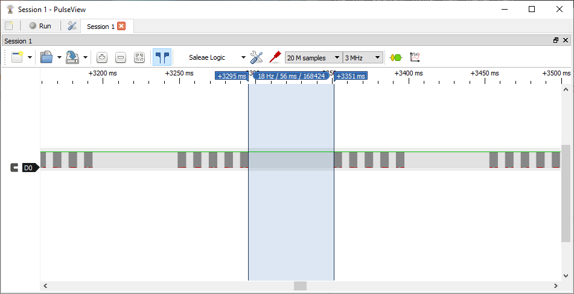
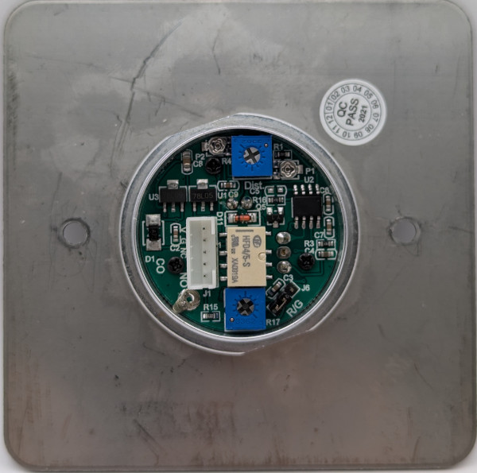

### Device Description

The SMB-I016 can be identified by its flat rather than bevelled metal ring that surrounds the IR filter. The filter has a ((🤚)) print similar to the DS-K7P03 but only two (( on either side. 

### Source

Provided by [en4rab](https://twitter.com/en4rab)/[en4rab](https://github.com/en4rab).

### Signal Pattern

Modulation is 37.31 kHz with a signal made up of 5 pulses with on time of about 5.098 mS and an off time of about 5.110 mS followed by a gap of 56.141 mS before the signal repeats. 

A quick test recording this and playing it back with a flipper zero did not trigger the sensor so it seems that the time between sent and received signal is checked.

A pulseview recording of this signal, made using a TSMP58000, can be found in the [/sigrok/smb-i016](/sigrok/smb-i016) directory. 

### Images

