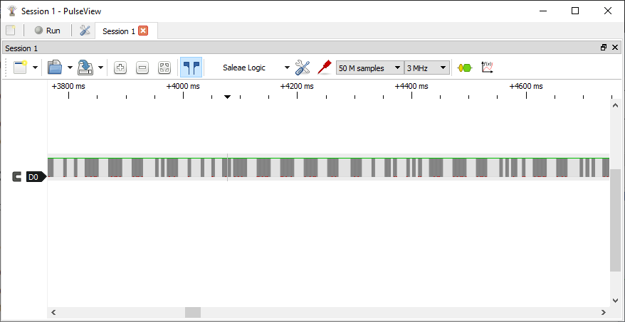
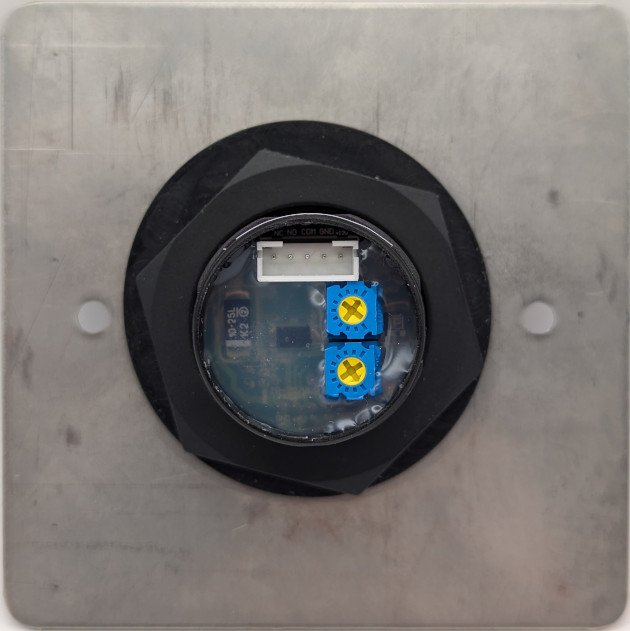

### Device Description

The SP80NT is part of a wider range of touch free sensors from the company [Videx](https://www.videxuk.com/series/nt-series-touch-free-entry-exit/) 

The range all seem to use the same sensor module which is a round black plastic bezel surrounding the IR filter with a distinctive LED at the 12 o'clock position. 

### Source

Provided by [en4rab](https://twitter.com/en4rab)/[en4rab](https://github.com/en4rab).

### Signal Pattern

The timing of this seemed erratic with no obvious pattern however testing by recording and playing back with a flipper zero showed it was vulnerable to signal replay. It could also be triggered by the IR autofocus light of a pixel 7 phone while the camera app was open.

Modulation is 11.37 kHz with an on time of about 23.2 mS and an off time of about 17.7 mS the off time is not critical as it still triggered with an off time much larger than this. 

A pulseview recording of this signal, made using a TSMP58000, can be found in the [/sigrok/sp80nt](/sigrok/sp80nt) directory. 

### Images

