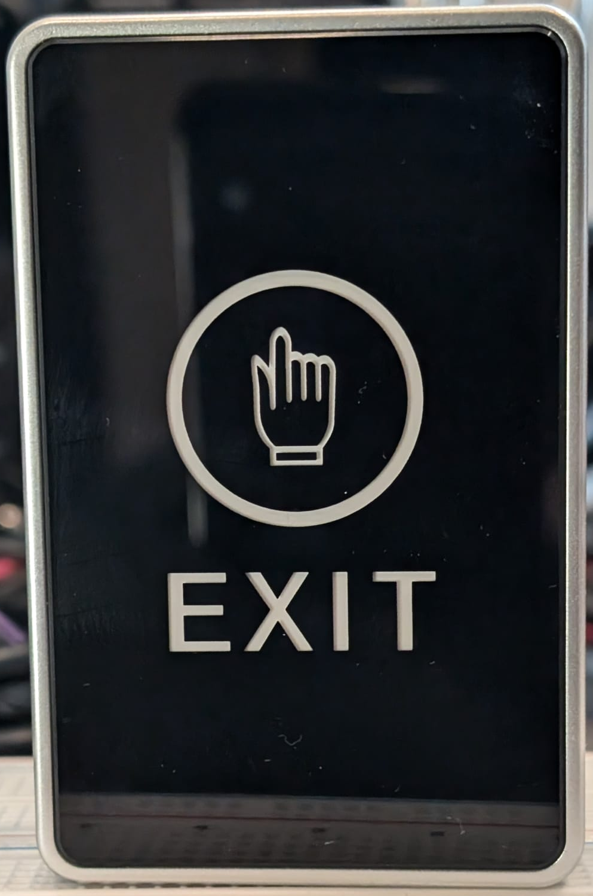
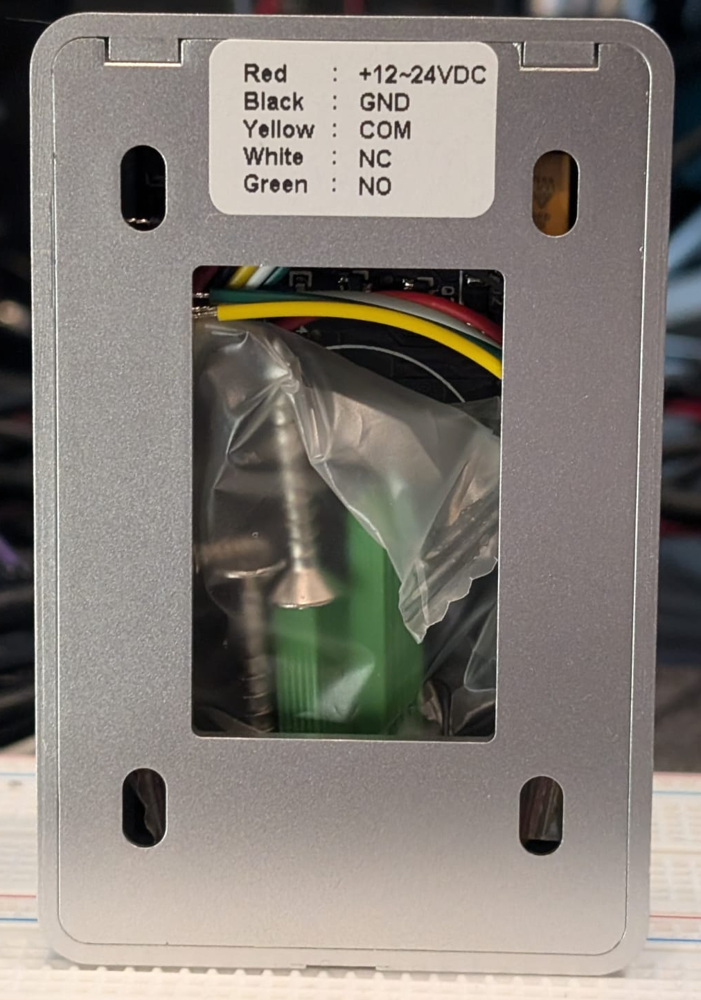

### Device Description

This device was advertised on amazon as an IR touchless exit sensor, but turned out to be a capacitive sensor. Does not display a model number or brand of anykind on the enclosure or PCB.

### Sources

[R3n5sk1](https://twitter.com/R3n5k1)/[CR-DMcDonald](https://github.com/CR-DMcDonald), tested 1 device. Purchased from Amazon UK in 2024.

### Images

