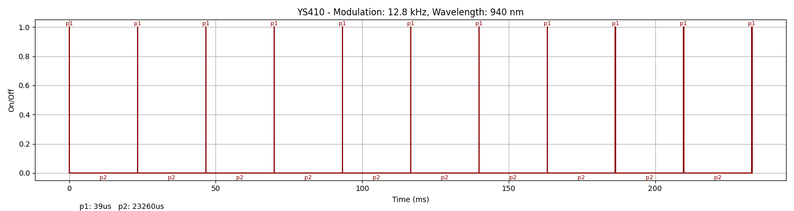
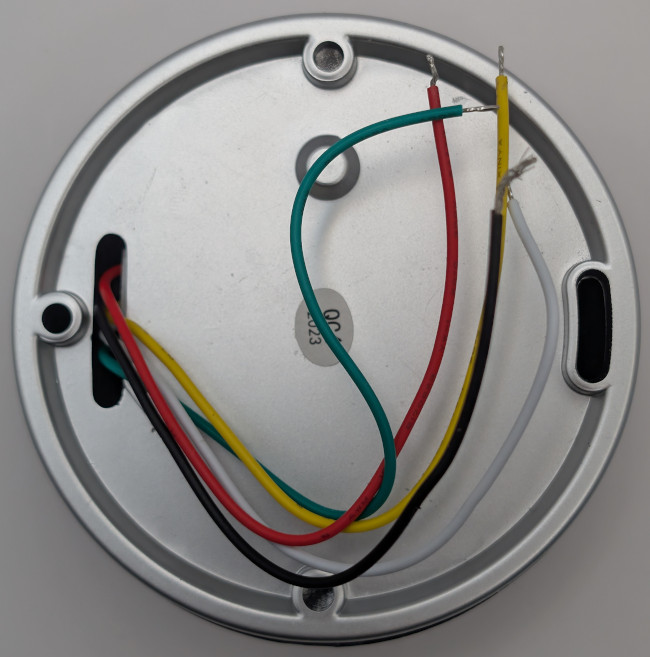
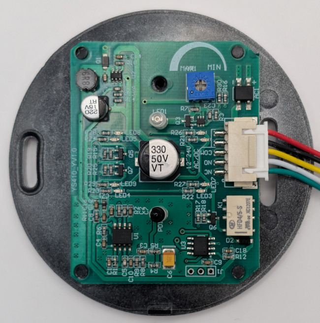

### Device Description

The YS410 arrived in a box without markings and was named based on some silkscreen text found on the PCB. It has a distinctive round silver plastic body with the IR filter forming the central logo (🖐) the brackets are also the red/green lights to show the lock status.

### Source

Provided by [en4rab](https://twitter.com/en4rab)/[en4rab](https://github.com/en4rab). bought July 2024 from Asia-Teco on AliExpress

### Signal Pattern

It uses a simple continuous pulsed signal with an on time of 39 uS and an off time of 23260 uS.  
Rather than using an off the shelf 38KHz IR receiver module the purchased example uses a photo diode and an LM358 op-amp although Aliexpress listings show a version with a receiver module.  
Testing the signal for the dsk7p03 and NT1 generated an open every few seconds. Treating the single pulse as one pulse of a 12.8KHz 50% signal and sending this for 2 seconds worked.

A pulseview recording of this signal taken from the base of the transistor can be found in the [/sigrok/ys410](/sigrok/ys410) directory. 

##### irplot.py data
```
12.8 kHz, 940 nm, YS410, 10, 39us, 23260us
```

##### irplot.py trace


### Images



